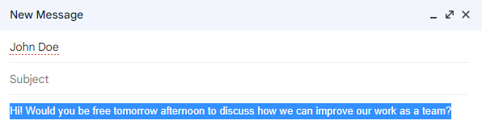

# NEGATIVITY CHECKER

#### Description

# Table of contents
* [About The Project](#about-the-project)
* [Getting Started](#getting-started)
* [Protoyping Changes](#protoyping-changes)
* [Documentation](#documentation)

# About The Project

In our current timeline where wars and plague outbreaks are happening, we should try not to make the world any more negative. On the internet where things are easier said than taken back, we should ensure that whatever we say is not negative.

**You might be wondering. How can we be less negative with what we say?**

I have created a chrome extension that measures the negativity level of anything that the user types through the use of Tensorflow models. Even though it might not detect all negativity due to our constantly evolving slang and language, every bit helps.

### Built With

- Node.js
- HTML
- TensorflowJS
- webpack

# Getting Started

Here's how you can add the extension to your browser

**Prerequisites**
- any browser that supports chrome extensions
- Chrome
- Microsoft Edge
- Brave Browser
- Opera

**Adding Extension**

1. Download the build folder in the project
2. Go to your browser's page to manage extensions
    - Chrome: [chrome://extensions](chrome://extensions)
    - Edge: [edge://extensions/](edge://extensions/)
3. Enable developer mode
4. Click on load unpacked
5. Select the build folder

Tada! You should see it in your list of extensions.

**Using Extension**
1. Click on the extension button in your browser, usually located at the top right hand corner

    

2. Click on the pin button to add it to your extensions bar

    

3. You should now see the extension on your extension bar!

    

4. For example, the next time you are sending an email you can use the extension. After typing your email, highlight the text you want to measure.

    

5. Click on the extension on your extension bar

    

6. A popup should appear

    

7. Click on the measure button ensuring that the text you want to measure is still highlighted

    
    
    As you can see, the text is slightly toxic and has a bit of insult and a little bit of threat. This is not good and we should phrase our sentences less negatively!

8. Let's try rewriting our email with a less negative tone!

    

9. Let's highlight it

    

10. Let's run it through the extension again

    

    Great! Our email returns 0% on all possible negativity.

# Protoyping Changes

## Initial Application Idea

Initially, I wanted to create a chrome extension that will block out any negative text on the HTML DOM. I managed to identify all text on an HTML DOM (including lazy loaded and paginated data). However, passing a huge amount of text through a Tensorflow model where predictions take a small amount of time to compute, slowed down chrome and browsing experience significantly. Therefore, I decided to find another way to implement an application with a similar idea of measuring negativity.

## Tensorflow Model

From my research, Tensorflow supports using models in Node.js and this is crucial for creating a chrome extension that uses a machine learning model. Therefore, I decided to go with Tensorflow.

Initially, I found my own data set, wrote a script for preparing data for training, and wrote and trained my own text classifier model in python.

However, upon converting and using TensorflowJS, I realized that my model is nowhere as accurate or as fast as the model developed by Tensorflow. Therefore I decided to go with the TensorflowHub model.

# Documentation

For detailed documentation of each file, [Documentation.md](./documentation.md)

# Aknowledgements

These are the list of resources I have used constantly during the development of this project

- [TensorflowJS API](https://js.tensorflow.org/api/latest/)
- [Chrome extension development guide](https://developer.chrome.com/docs/extensions/mv3/getstarted/)
- [Webpack documentation](https://webpack.js.org/)
- [Tensorflow Models](https://github.com/tensorflow/tfjs-models)
