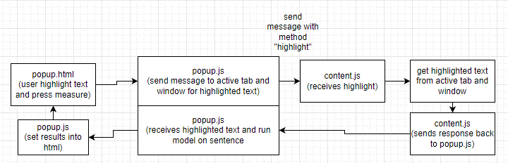

# Documentation

## Table of contents

* [Application Workflow](#application-workflow)
* [popup.js](#popupjs)
* [content.js](#contentjs)
* [Webpacking](#webpacking)

# Application Workflow



# popup.js

Firstly, we have to import TensorflowJS and the Tensorflow toxicity model
```
// require tensorflow modules
const tf = require('@tensorflow/tfjs');
const toxicity = require('@tensorflow-models/toxicity');
```

This is the list of ids in popup.html where the results will be placed
```
// list of html ID where prediction values are placed
const VALUE_IDS = ["IAValue", "IValue", "OValue", "STValue", "SEValue", "ThreatValue", "ToxicityValue"]
```

When popup.html is loaded, we have to add an event listener on the measure button
```
document.addEventListener('DOMContentLoaded', function () {
    // add onclick listener to measure button
    document.getElementById('measureBtn').addEventListener("click", measure);
})
```

Next, we will create the measure function. The code will be documented with comments on what each line does
```
function measure() {
    // query the active tab and window to the user's current selected item
    chrome.tabs.query({ currentWindow: true, active: true }, function (tabs) {
        var activeTab = tabs[0];
        // send a message to active tab and window's content page to highlighted item
        chrome.tabs.sendMessage(activeTab.id, { "method": "highlight" }, response => {
            // place selected sentence into a variable
            var sentence = response.data
            // trim to ensure that sentence is not " "
            if (sentence.trim()) {
                // place sentence into text area in the popup so users know what they are measuring
                document.getElementById('textarea').value = sentence
                // set value placeholders with loading animation
                VALUE_IDS.forEach(id => {
                    document.getElementById(id).innerHTML = '<div class="loader"><div class="dot"></div><div class="dot"></div><div class="dot"></div></div>'
                });
                // pass sentence into predict function where it will run the model
                predict(sentence).then(res => {
                    // res is the result of the predictions
                    // set values into html
                    VALUE_IDS.forEach((id, i) => {
                        // values are returned in decimals with 1 and 0 being the highest and lowest respectively
                        // multiply by 100 and remove decimals
                        let toxicity = (((res[i]['results'][0]['probabilities'][1])*100).toFixed(0))
                        document.getElementById(id).innerHTML = `${toxicity}%`
                    });
                })
            } else {
                // if sentence is empty reset placeholder to default -
                document.getElementById('textarea').value = ""
                VALUE_IDS.forEach(id => {
                    document.getElementById(id).innerHTML = '-'
                });
            }

        });
    });
}
```

Next, we will create the predict function. The code will be documented with comments on what each line does
```
function predict(sentence) {
    // load tensorflow model
    // 0.85 is the minimum confidence that we will accept
    return toxicity.load(0.85).then(model => {
        // with the model's classify method to convert sentence into a vector
        return model.classify([sentence]).then(predictions => {
            // return predicted value generated from the model
            return predictions
        })
    })
}
```

# content.js

In content.js, we will have to create the message listener and get the selected text and return it to popup.js where the message was sent
```
// create listener to listen for incoming message from measure function in popup.js
chrome.runtime.onMessage.addListener(
    function (request, sender, sendResponse) {
        // if request fits what is required
        if (request.method === "highlight") {
            // get selection and send response back to measure() in popup.js
            sendResponse({ data: window.getSelection().toString() });
        }
    }
)
```

# Webpacking

Since TensorflowJS is imported using require() and require is not built into the browser, we have to create a build using webpack.

Following the documentation at [Webpack Documentation](https://webpack.js.org/concepts/), we have to create a config file.

Other than the standard webpack config, it is important to use a source map where eval() is not used as it does not meet chrome's extension system Content Security Policy (CSP)
```
devtool: 'inline-source-map',
mode: "production",
```

Finally, run to build
```
npm run build
```

And relink the popup.html script file to the generated build file.
```
<script src="dist/main.js"></script>
```